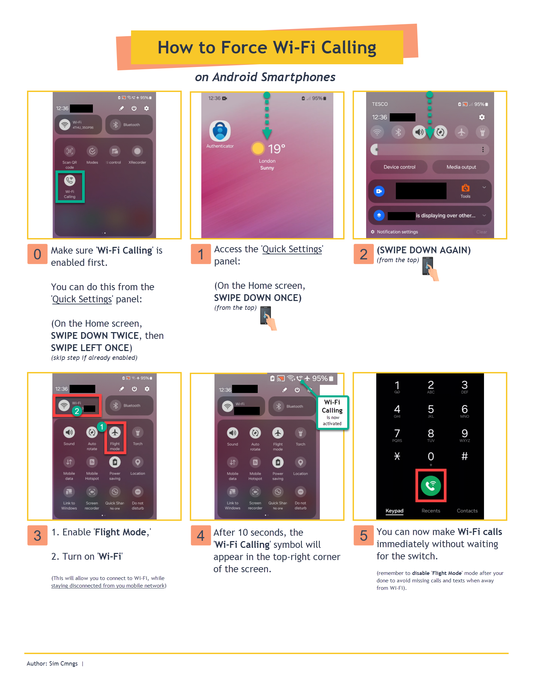
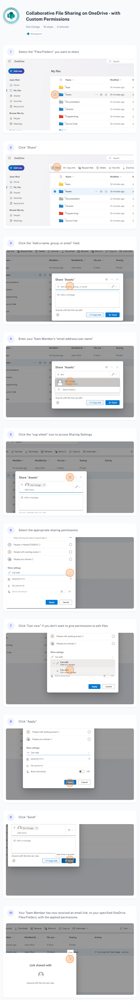

# UserSupportGuides

<details><summary>01. Using the Bitwarden Password Manager (Autofill Feature) </summary>

https://github.com/SimCmngs/UserSupportGuides/assets/166608651/2174efd4-6a02-42ba-8e8e-48aa8344f66d

</details>

> video tutorial

---

<details><summary>02. Using the Bitwarden Password Manager (Manual Prompts) </summary>

https://github.com/SimCmngs/UserSupportGuides/assets/166608651/47a662ee-4c21-44cd-8633-b69e6d2ac42e

</details>

> video tutorial

---

<details><summary>03. How to Force 'Wi-Fi Calling' (on Android Phones) </summary>



</details>

> quick reference guide

---

<details><summary>04. Setting Up TeamViewer - Remote Smartphone Support </summary>


</details>

> quick reference guide

---

<details><summary>05. File Sharing on OneDrive - with Custom Permissions </summary>



</details>

> user guide

---

<details><summary>06. Creating and Storing New Account Logins in Bitwarden </summary>


</details>

> user guide

---

<details><summary>07. Force Quit any Frozen App - on Windows </summary>


</details>

> quick reference guide

---

<details><summary>08. Activating Krisp - for Microsoft Teams </summary>


</details>

> email response template

---

<details><summary>09. Installing/Configuring Krisp - for Microsoft Teams </summary>


</details>

> support team instructions (internal ticket note)

---

<details><summary>10. Where to Find Missing Emails in Outlook </summary>


</details>

> troubleshooting instructions (user support ticket)

---

<details><summary>11. Fixing Chrome's 'Content Not Showing' Issue </summary>


</details>

> troubleshooting instructions (user support ticket)

---

<details><summary>12. Connecting to the Company VPN </summary>


</details>

> troubleshooting instructions (user support ticket)

---

<details><summary>13. Converting .exe files to .intunewin packages -script </summary>

```powershell
#Convert exe to intunewin | Win32 Content Prep Tool
#Author: Sim Cmngs

# Edit these variables to match your SETUP
$IntuneWinAppUtilFolder = "C:\Intune\3-IntuneWinAppUtil" # REPLACE with Intune Win32 Content Prep Tool location 
$SourceFolder = "C:\Intune\1-Krisp" # REPLACE with app setup file location 
$SetupFile = "Krisp_2.33.5" # REPLACE with name of app setup file
$OutputFolder = "C:\Intune\2-IntuneApps" # REPLACE with folder location to save IntuneWin file

# Change Directory
Set-Location -Path $IntuneWinAppUtilFolder

# Run Intune Win32 Content prep tool with parameters
& "$IntuneWinAppUtilFolder\IntuneWinAppUtil.exe" -c "$SourceFolder" -s "$SourceFolder\$SetupFile.exe" -o "$OutputFolder" -q
```


</details>

> support team PowerShell script (+ demonstration)

---

<details><summary>14. Software installs for new PCs -script </summary>

<ins>Setup new windows device (Winget)</ins>

```powershell
#Install Winget - Windows Package Manager

# Get latest download url
$progressPreference = 'silentlyContinue'
$latestWingetMsixBundleUri = $(Invoke-RestMethod https://api.github.com/repos/microsoft/winget-cli/releases/latest).assets.browser_download_url | Where-Object {$_.EndsWith(".msixbundle")}
$latestWingetMsixBundle = $latestWingetMsixBundleUri.Split("/")[-1]

# Download Visual C++ Runtime and Winget packages
Write-Information "Downloading winget to artifacts directory..."
Invoke-WebRequest -Uri $latestWingetMsixBundleUri -OutFile "./$latestWingetMsixBundle"
Invoke-WebRequest -Uri https://aka.ms/Microsoft.VCLibs.x64.14.00.Desktop.appx -OutFile Microsoft.VCLibs.x64.14.00.Desktop.appx

# Install Visual C++ Runtime and Winget packages
Add-AppxPackage Microsoft.VCLibs.x64.14.00.Desktop.appx
Add-AppxPackage $latestWingetMsixBundle

```

<ins>Setup new windows device (App installs) </ins>

```powershell
#Automate installation of essential applications | Winget
#Author: Sim Cmngs

# Function to install an application using Winget
function Install-App {
    param (
        [string]$appName
    )
    
    Write-Host "Installing $appName..."
    try {
        winget install --id=$appName --silent --accept-package-agreements --accept-source-agreements
        Write-Host "$appName installed successfully."
    } catch {
        Write-Host "Failed to install $appName. Error: $_" -ForegroundColor Red
    }
}

# List of essential apps to install (edit list if needed)
$applications = @(
    # Web Browsers
    "Google.Chrome",
    "Mozilla.Firefox",
    
    # Security and Antivirus
    "Bitdefender.Bitdefender",
    "Bitwarden.Bitwarden",

    # System Monitoring and Maintenance
    "BleachBit.BleachBit",
    "Klocman.BulkCrapUninstaller",
    "CPUID.HWMonitor",

    # Office and Productivity
    "ONLYOFFICE.DesktopEditors",
    "Adobe.Acrobat.Reader.64-bit",

    # Remote Access and Support
    "TeamViewer.TeamViewer",

    # Communication Tools
    "Microsoft.Teams",
    "Zoom.Zoom",
    "Discord.Discord",

    # Media
    "Audacity.Audacity",
    "CodecGuide.K-LiteCodecPack.Full",
    "VideoLAN.VLC",
    "NGWIN.PicPick",

    # Backup Solutions
    "Google.GoogleDrive",
    "Microsoft.OneDrive",

    # Runtimes
    "abbodi1406.vcredist",
    "Microsoft.DotNet.Runtime.8",
    "Microsoft.DotNet.DesktopRuntime.8",

    # File Management and Compression
    "7zip.7zip",
    "RARLab.WinRAR",

    # Utilities
    "AdrienAllard.FileConverter",
    "Microsoft.PowerToys"
)

# Install each application
foreach ($app in $applications) {
    Install-App -appName $app
}

Write-Host "All essential applications have been installed."

```

</details>

> support team PowerShell script

---

<details><summary>15. Self-Service Password Reset / Microsoft 365 Password Reset</summary>

<ins>Setup Self-Service Password Reset (Microsoft 365)</ins>


<ins>Resetting your Microsoft 365 Password - with SSPR Activated</ins>


</details>

> quick reference guide 
